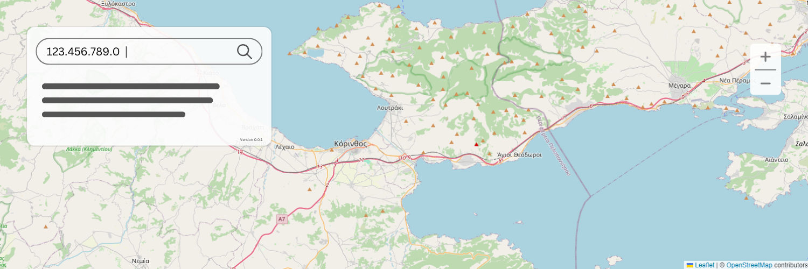

## Ip Maps (BETA)

# Key Features
- IP Address Retrieval:

The tool uses the ipify API to retrieve the user's current public IP address automatically.
- Location Lookup:

It utilizes the ip-api service to fetch geographical information (latitude, longitude, city, region, and country) based on the provided IP address.
- Map Integration:

The tool integrates with the Leaflet library to display the geographical location on an interactive map.
OpenStreetMap is used as the map tile provider, ensuring a free and open-source mapping solution.
- User Interface:

The interface is built with Bootstrap for a responsive and modern design.
An input field allows users to enter any IP address to find its location.
A search button triggers the location lookup and map update.
Additional controls allow users to adjust the map view and circle accuracy radius dynamically.
- Accuracy Radius:

A circle overlay is drawn around the marker on the map to indicate the accuracy range.
Users can adjust the radius of this circle to visualize different levels of location accuracy.
- Responsive Design:

The map and controls are fully responsive, making the tool usable on both desktop and mobile devices.
How to Use
- Automatic Location Display:

On loading the page, the tool automatically fetches and displays the user's current IP address and its location on the map.
- Manual IP Address Search:

Enter any valid IP address in the provided input field and click the "Search" button.
The map will update to show the location of the entered IP address.
- Adjusting Accuracy Radius:

Enter a desired radius value (in meters) in the "Set Circle Radius" input field.
Click the "Update Radius" button to adjust the circle's size on the map, providing a visual representation of the location accuracy.

## Technologies Used
- JavaScript: For making API requests and handling map interactions.
- HTML/CSS: To structure and style the webpage.
- Bootstrap: For responsive design and modern UI components.
- Leaflet: For interactive map display and handling map layers.
- ipify API: To retrieve the user's public IP address.
- ip-api Service: To fetch geographical information based on IP address.
- OpenStreetMap: As the tile provider for the map.
- This tool is useful for developers, network administrators, or anyone interested in finding and visualizing the geographical location of IP addresses. The responsive design ensures it works seamlessly across various devices, providing a user-friendly experience.

